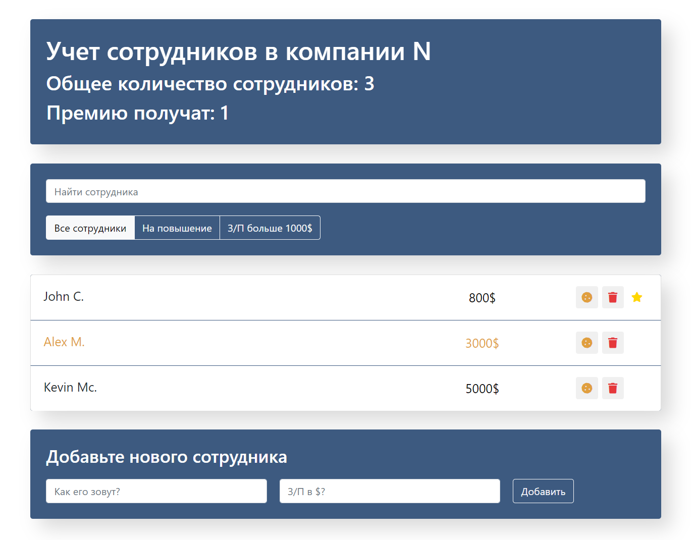

<!-- PROJECT LOGO -->
<div align="center">
  <h1 align="center">Employee react-app</h1>
  <p align="center">
    Приложение по учету сотрудников
    <br />
    <br />
    <a href="https://regina5425.github.io/react-test-app-employees/">Посмотреть демо</a>
  </p>
</div>


<!-- ABOUT THE PROJECT -->
## О проекте

<div align="center">
  <span>
    
   </span>
</div>

Функционал:
* добавление/удаление сотрудника;
* поиск сотрудника;
* фильтрация сотрудников по параметрам;
* метка сотрудников для премий и повышения


### Стек

React, React Hooks, JavaScript, CSS, HTML, Bootstrap


<!-- GETTING STARTED -->
### Установка

1. Склонировать репозиторий
   ```sh
   git clone https://github.com/Regina5425/react-test-app-employees.git
   ```
2. Установить NPM пакеты
   ```sh
   npm install
   ```
3. Запустить приложение на вашем локальном сервере
   ```js
   npm start
   ```

<!-- CONTACT -->
## Контакты

Регина А. - reina5425@gmail.com

Ссылка на проект: [https://github.com/Regina5425/react-test-app-employees](https://github.com/Regina5425/react-test-app-employees)


